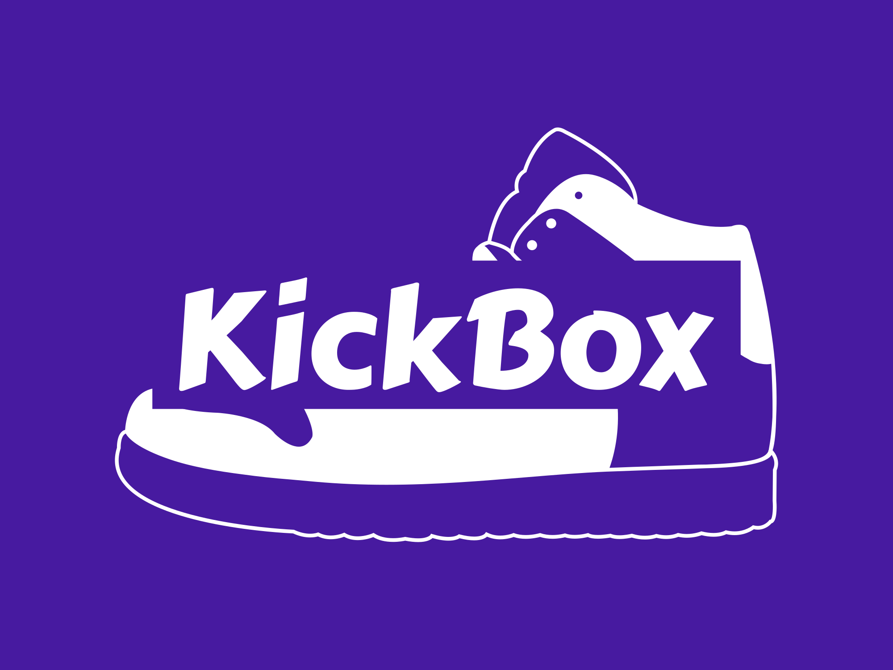
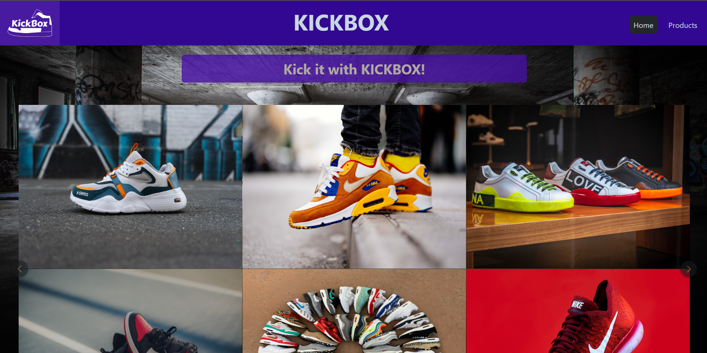
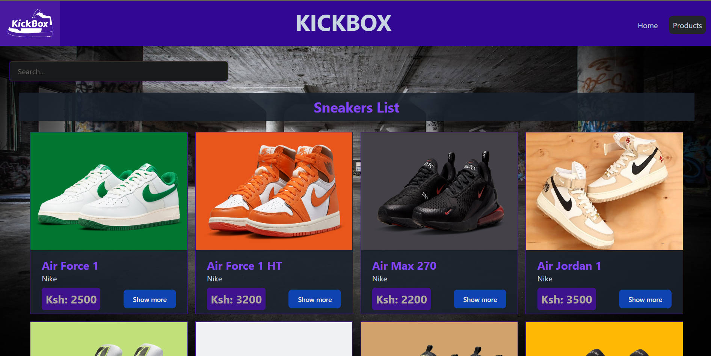
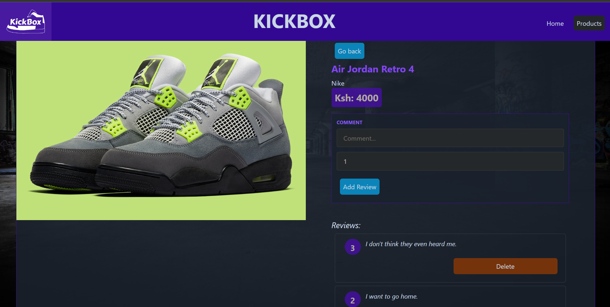

[](logo.png)

# KICKBOX

## By: ROY OKITE

## Project Description

This is the frontend react application for a sneakers ecommerce website. Kickbox is the name of the webiste, which has been designed to display a page of all the available sneakers with details including the image, name, description and price as well as a show more option for additional information on particular sneakers moreso regarding reviews.

The application was developed to meet the set project requirements:

- It is a single page application.
- It is Intuitive and has an easy to follow layout.
- It utilises pages and components for code organization and resusability.
- The application employs the use of client-side routing for page to page navigation.
- A GET, POST and DELETE request. There are achieved by using a backend API developed as part of the project as well, to source information from this frontend side.
  <br />
  <br />

  

## Deliverables

The app utilizes a single HTML file, Tailwind CSS for styling and Javascript/JSX for interactivity.

A user is able to:

- View product information on available sneakers.
  <br /> <br />
  
  <br /> <br />
- Click show more on each sneaker to get view of individual sneaker reviews which the option to add new or delete submitted reviews.
  <br /> <br />
  
  <br /> <br />

## Setup Instructions

The project has been deployed and hosted on [netlify](https://app.netlify.com) which is a remote-first cloud computing company that offers a development platform that includes build, deploy, and serverless backend services for web applications and dynamic websites.

On a local setting the frontend is linked to a API developed using Ruby to feed it information on products, these are gotten from a database. Run npm start to run the project locally by starting the server.

The deployed project can be accessed at [KickBox](https://kickbox-sneakers.netlify.app).

### Closing

This react app took a few days to plan, design, develop and deploy. More interactivity and modifications will be made overtime even after submission to polish the style, data and components available on the app.

Sample code to create the gallery on the landing page:

```
const Gallery = () => {
  let imageStyle = {height: "22rem", width: "100%"}
  return (
    <Carousel
      cols={3}
      rows={2}
      gap={1}
      loop="true"
      showDots="true"
      autoplay={2000}
      dotColorActive="rgb(124 58 237)"
      dotColorInactive="rgb(0 0 0)"
    >
      <Carousel.Item>
        
      </Carousel.Item>
      <Carousel.Item>
        
      </Carousel.Item>
      <Carousel.Item>
        
      </Carousel.Item>
      <Carousel.Item>
        
      </Carousel.Item>
      <Carousel.Item>
        
      </Carousel.Item>
      <Carousel.Item>
        
      </Carousel.Item>
      <Carousel.Item>
        
      </Carousel.Item>
      <Carousel.Item>
        
      </Carousel.Item>
      <Carousel.Item>
        
      </Carousel.Item>
      <Carousel.Item>
        
      </Carousel.Item>
      <Carousel.Item>
        
      </Carousel.Item>
      <Carousel.Item>
        
      </Carousel.Item>
    </Carousel>
  )
}
```

### Closing

All the information and resources used have been sourced from publicly available resources as well as the aforementioned API. This is a project aimed to train development as well as engage in the idea of a need for a reliable and affordable source of sort after sneakers for consumers who are sneaker fanatics but do not wish to physically visit stores for latest or overpriced brands.

## This project aims to fulfill requirements for the Moringa School SD phase 3 project.
